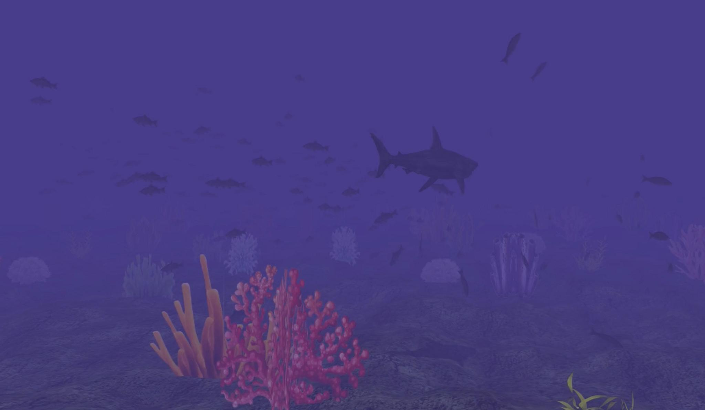
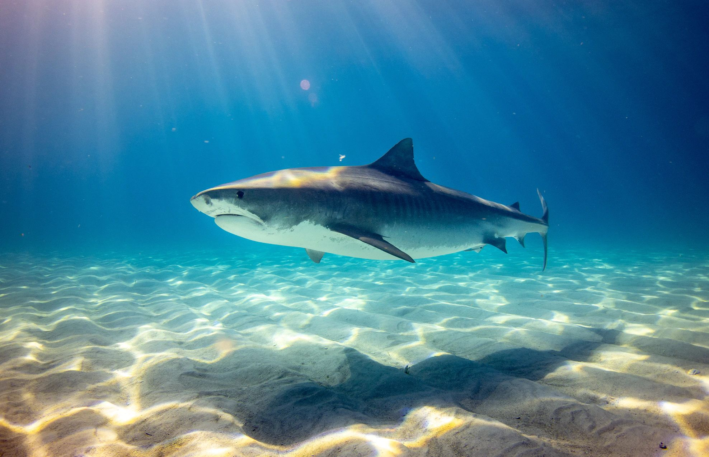
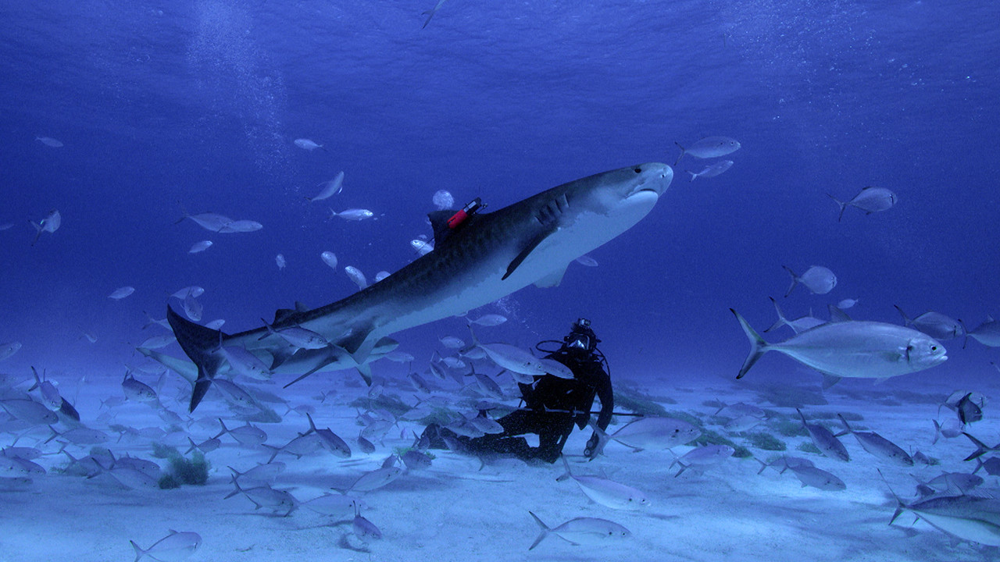
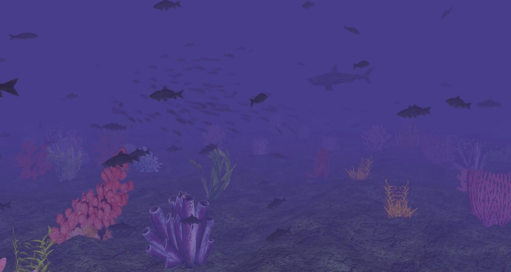
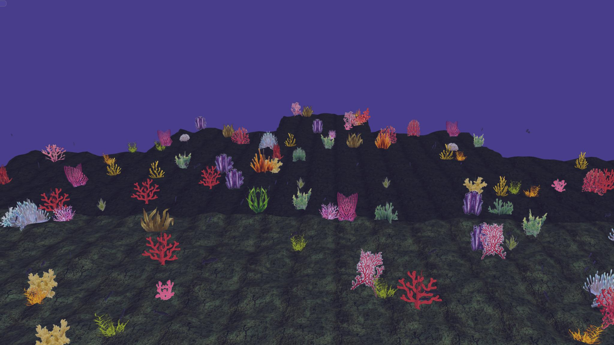
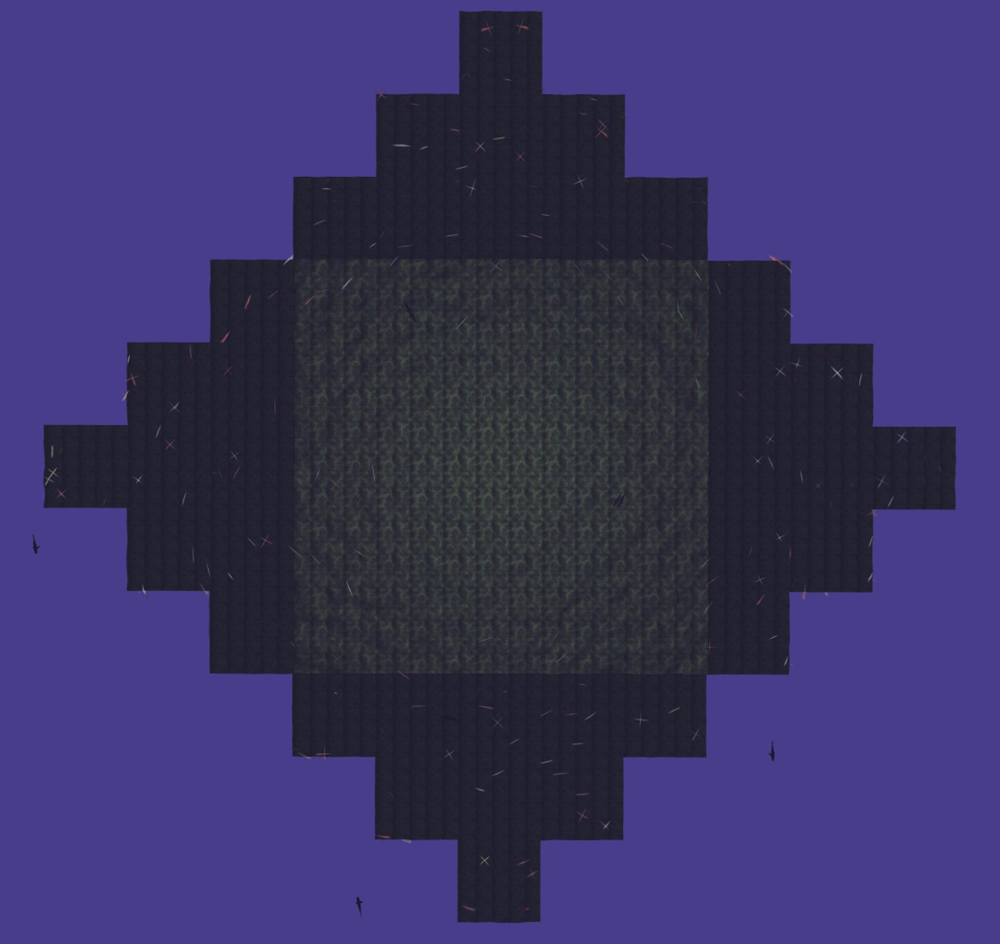
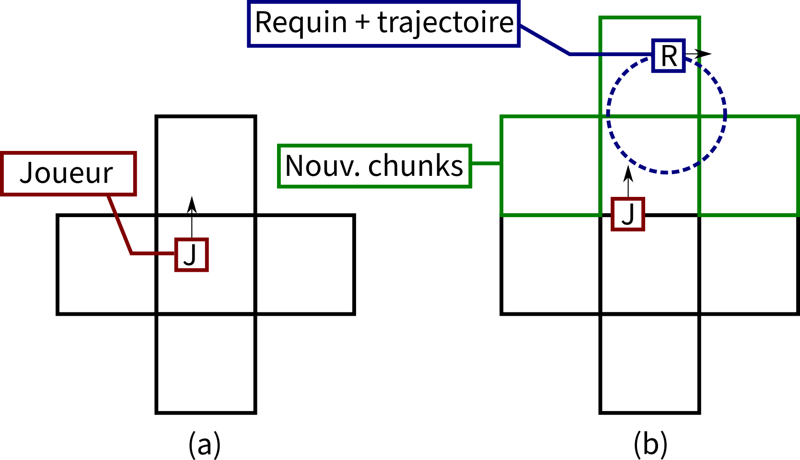
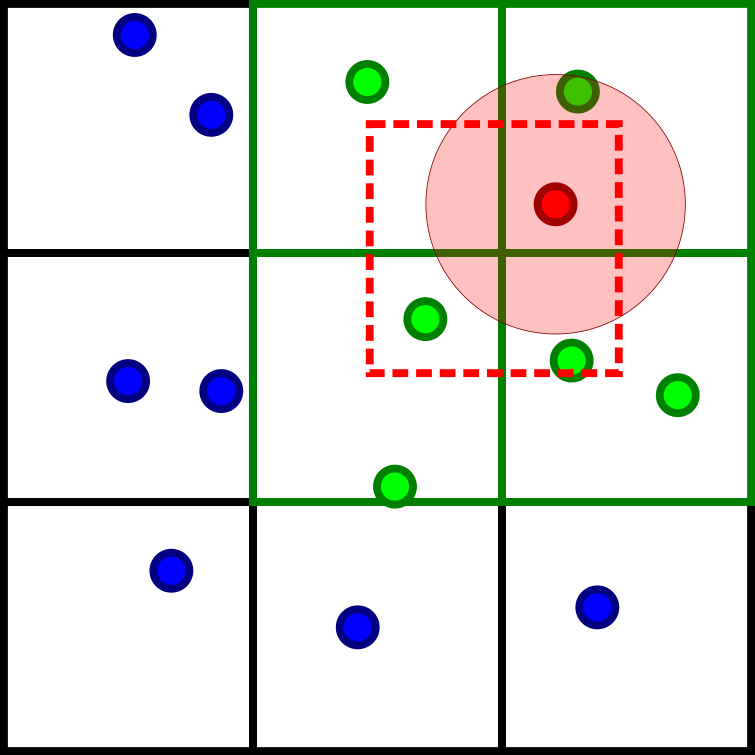

# Création de scène 3D : *Deep in the Shark Sea*

~ [Amine Chaabouni](https://github.com/amine-chaabouni) et [Valentin Ogier](https://github.com/vogr)



<em>Petits poissons et requins nagent parmi les coraux.</em>

## Compilation et execution

```console
$ git clone https://github.com/vogr/OceanGL
$ cd OceanGL
$ ./build.sh
$ ./build/pgm
```

## Introduction


Dans ce projet, notre objectif a été de créer un monde sous-marin qui
pourrait être librement exploré. Créer une ambiance sous-marine
nécessite de reproduire des objets et des phénomènes que l'on peut
observer dans les profondeurs des océans. Les deux images de la Figure
ci-dessous permettent d'en identifier certains :

-   la présence de poissons, qui se déplacent généralement en bancs, et
    adoptant des comportements de groupe complexes.

-   la présence de caustiques , phénomène lumineux visible sur le fond
    marin ou sur les poissons sous la forme de ronds de lumière en
    mouvement, causé par la réfraction de la lumière du soleil à travers
    les vaguelettes à la surface de l'eau.

-   un phénomène d'absorption sélective des couleurs par l'eau conduit à
    un assombrissement des objets les plus lointains, qui prennent alors
    une teinte bleue ou violette et réduit la visibilité du plongeur.

-   le déplacement d'un plongeur est différent de celui d'une personne
    sur la terre ferme : la force de frottement qui s'oppose à son
    mouvement et faible, et donc si le plongeur nage puis arrête tout
    mouvement, il va continuer à avancer en décélérant lentement.

-   la présence de végétation sous-marine : algues, coraux, et éponges
    par exemple.

-   espace extrêmement vaste, dont on ne voit pas d'extrémité.



<em>Caustiques, ombre portée, et brouillard (Gerald Schömbs)</em>



<em>Requin et banc de poissons (National Geographic)</em>

Nous avons donc mis en œuvres des méthodes pour reproduire de façon
crédible ces phénomènes et ces objets dans l'environnement virtuel que
nous avons créé. La Table
ci-dessous résume nos choix de méthodes.


<table>
  <thead>
    <tr>
      <th>Phénomène / objet</th>
      <th>Méthode</th>
    </tr>
  </thead>
  <tbody>
    <tr>
      <td>Banc de poissons</td>
      <td><ul>
        <li>Modèle des <em>Boids</em></li>
        <li>Règles supplémentaires pour gérer l'orientation, et l'évitement du sol et des des requins</li>
      </ul></td>
    </tr>
    <tr>
      <td>Requins</td>
      <td><ul>
        <li>Trajectoire par interpolation entre *keyframes*<ul><li>Spline cardinale pour la position</li><li>Interpolation sphérique linéaire entre quaternions pour la
        rotation</li></ul></li>
        <li>Sphère englobante pour la gestion de l'évitement par les petits
    poissons.</li>
      </ul></td>
    </tr>
    <tr>
      <td>Caustiques</td>
      <td><ul>
        <li>Projection de texture animée</li>
        <li><em>Shadow mapping</em></li>
      </ul></td>
    </tr>
    <tr>
      <td>Obscurcissement selon la distance</td>
      <td><ul>
        <li>Prise en compte de la distance à la caméra dans le <em>fragement
    shader</em></li>
        <li>Modèle du brouillard exponentiel</li>
      </ul></td>
    </tr>
    <tr>
      <td>Plongeur (utilisateur)</td>
      <td><ul>
        <li>Caméra première personne, contrôle clavier-souris.</li>
        <li>Mouvement par simulation physique avec peu de frottements</li>
      </ul></td>
    </tr>
    <tr>
      <td>Algues et coraux</td>
      <td><ul>
        <li>Billboards croisés.</li>
        <li>Apparence et rotation aléatoires.</li>
      </ul></td>
    </tr>
    <tr>
      <td>Monde pseudo-infini</td>
      <td><ul>
        <li>Création du terrain par bruit de Perlin</li>
        <li>Génération aléatoire des objets sous-marins (requins et végétation)</li>
        <li>Stockage et chargement par régions (*chunks*)</li>
      </ul></td>
    </tr>
  </tbody>
</table>


Nous décrirons plus en détail ces méthodes dans les parties suivantes.
La figure ci-dessous présente le résultat obtenu suite à la
mise en œuvre de toutes ces méthodes pour créer une scène sous-marine.



<em>Scène sous-marine obtenue</em>

## Le monde


### Monde infini : *chunking* et génération aléatoire


Afin de donner l'illusion d'un monde sous-marin extrêmement vaste, nous
avons souhaité ne pas limiter dans l'espace l'étendue de notre scène (ou
du moins de le rendre suffisament vaste pour qu'un joueur n'en atteigne
jamais les bords). Comme il n'est pas envisageable de générer en une
seule fois ce monde très large, ni de dessiner à l'écran l'intégralité
de ce monde à chaque image de l'animation, il est nécessaire de diviser
le monde en régions (*chunks*) : seules les régions autour du joueur
seront prises en compte lors du rendu, et ces régions seront générés à
mesure que le joueur se déplace dans le monde.

Notre terrain est divisé selon une grille carrée, chaque case de la
grille est un *chunk*. La Figure
ci-dessous rend ce découpage visible : seuls les *chunks*
à distance 6 ou moins (en norme 1) du joueur sont pris compte pour le
rendu.



<em>Vue du joueur</em>



<em>Vue de haut</em>

Dans le code C++, c'est l'objet qui est responsable de gérer le
chargement et la génération des objets de type , qui stockent chacun
pour une de ces régions :

-   le maillage du terrain (généré à partir d'une unique fonction de
    bruit de Perlin pour l'intégralité du monde, assurant la continuité
    aux bords des chunks)

-   les éléments de décors (i.e. billboards figurant la végétation)
    présents sur le chunk, dont les positions, types, et rotations sont
    tirés de manière aléatoire lors de la génération du *chunk*.

### Algues et coraux : *billboards* croisés


Les algues et coraux sont créés sous la forme de texture 2D plaqués sur
des *billboards* mis en croix pour leur donner plus de volume. Étant
donné l'utilisation de transparence dans les textures, et afin d'éviter
les erreurs de rendu, il est nécessaire de les dessiner du plus éloigné
au plus proche. Pour éviter les les erreurs de rendu sur une croix de
billboards, chaque croix est décomposée en quatre parties ; ces parties
seront dessinés de la plus loin à la plus proche (cet ordre est calculé
à partir d'un simple produit scalaire), comme expliqué sur la figure
ci-dessous.


Ces *billboards* sont placés à des positions aléatoires dans les
*chunks* (tout en respectant une distance minimale entre eux), avec une
rotation et une texture tirées aléatoirement.

## Animaux marins : des modèles animés


### Les requins : interpolation de trajectoire


Les requins sont placés dans le monde au fur et à mesure que le joueur
se déplace : lorsqu'un nouveau *chunk* est généré (donc hors de la vue
du joueur), un requin a un 12% de chance d'y apparaître ; on lui
attribue dans ce cas une trajectoire circulaire fixe dont le rayon est
tiré aléatoirement, avec éventuellement une variation d'altitude au
cours du mouvement. Cette méthode permet de faire apparaître les requins
hors de la vue du joueur, même si sa trajectoire peut s'étendre sur
plusieurs chunks (voir la figure
ci-dessous).



<em> Génération des requins : (a) le joueur J se déplace dans des chunks déjà générés (b) le déplacement du joueur J entraîne la génération de nouveaux chunks, un requin apparaît dans l'un d'eux</em>

Les objets sont utilisés pour représenter les requins. Ils stockent :

-   une trajectoire (type ) qui donne à chaque image une position et une
    rotation au requin par interpolation entre des *keyframes* définis
    lors de l'apparition du requin.

-   le modèle 3D d'un requin.

L'ensemble des requins est géré par l'objet , qui s'occupe de leur
apparition, de leur mise à jour à chaque image, et de leur rendu.

### Bancs de poissons et comportements de groupe : les *Boids*


Pour les poissons qui nagent autour des requins, on a préféré utiliser
une nouvelle méthode d'animation. Ainsi, contrairement aux requins, on
n'a pas adopté une animation descriptive en définissant au préalable le
trajet des poissons. L'animation choisie est le modèle des *Boids*,
défini par Craig Reynolds [^1] en 1986, auquel nous ajoutons certaines règles
pour obtenir le comportement voulu.

Le modèle des *Boids* a pour objectif de simuler le comportement d'un
groupe d'oiseau ou d'un banc de poissons (notre cas). Il consiste en la
définition de règles simples respectés de manière individuelle par
chaque poisson dans le banc, et qui entraîne l'émergence d'un
comportement de groupe complexe. Trois contraintes doivent être
respectées :

1.  Séparation : assez naturellement, on ne veut pas que les poissons se
    rentrent dedans. Chaque boid à un rayon et un angle de vision qui
    lui permettent de remarquer la présence d'autres boids et, ainsi, de
    s'éloigner légèrement de ces derniers afin d'éviter une éventuelle
    collision.

2.  Alignement : avec ce même rayon de vision, le boid va essayer
    d'aller dans la même direction que les boids qui les entourent.
    Cette action conduit à l'obtention de groupes d'individus qui se
    déplacent ensemble dans une direction.

3.  Cohésion : enfin, chaque boid va se diriger vers le centre de ce
    groupe. Ainsi, les poissons se rapprocheront et auront un objectif
    commun. L'implémentation de cette dernière contrainte permet
    d'obtenir des bancs de poissons resserrés.

Une fois les bancs de poissons simulés à partir de ces règles simples,
il a fallu les intégrer à la scène finale. Dès lors, il a été nécessaire
d'implémenter règles simples pour gérer la présence du sol et des
requins, et éviter les directions de nage peu naturelle :

1.  Préférence pour l'horizontalité : les boids préfèrent avoir une
    orientation qui ne les fait aller ni trop vers le haut, ni trop vers
    le bas.

2.  Évitement du sol (et du ciel) : les boids sont incités à rester dans
    un intervalle d'altitude donné.

3.  Évitement des requins : lorsqu'un boid voit un requin devant lui, il
    fait demi-tour, et lorsqu'il perçoit un requin derrière lui, il
    fuit.

Ces six règles se traduisent en six forces $\mathbf{F}_i$ qui
s'appliquent sur le boid ; on obtient alors l'accélération par le
principe fondamental de la dynamique $\sum\mathbf{F}_i = m \mathbf{a}$.

#### 

Pour donner une impression d'infinité du monde tout en gardant un nombre
fixe de boids dans le monde, nous avons limité la zone de déplacement
possible des poissons. Afin d'éviter la création de murs invisibles qui
conduirait à des mouvements peu naturel, on a mis en place une méthode
de *wraparound* dans un cube centré sur le joueur : lorsqu'un poisson
atteint le bord de ce cube, il est immédiatement téléporté de l'autre
côté du cube. Cette téléportation a lieu hors du champs de vision du
joueur, qui a alors simplement l'impression que de nouveaux poissons
arrivent de loin. Cette méthode permet également de garder une densité
importante de poissons autour du joueur, alors qu'un nombre fixe de
poisson est gardé en permanence.

#### 

Mettre en place ce modèle nous a conduit à faire des choix
d'implémentation :

-   Optimisation spatiale : une méthode naïve de mise à jour des boids
    consiste pour chaque boids à itérer sur tous les autres boids et à
    repérer ceux qui sont proches (seuls les voisins ont une influence).
    Une optimisation que nous avons implémenté consiste à diviser le
    cube dans lequel se situent les boids selon une grille régulière et
    à placer les boids dans les cases de cette grille ; pour une taille
    de case supérieure au rayon de vision du boid, un boid n'a à
    considéré que les boids qui sont dans la même case que lui ou dans
    les cases voisines (soit 9 cases à considérer). On peut même réduire
    à 4 le nombre de cases à prendre en compte en localisant le boid
    dans la grille duale à la première (voir la figure ci-dessous).

-   *Raymarching* pour la détection des requins : si on appelle
    $\left\{\mathbf{T} ; \mathbf{N}; \mathbf{B}\right\}$ le repère local
    d'un boid, la détection des requins consiste en du raymarching dans
    les 26 directions donnés par
    $a\mathbf{T} + b\mathbf{N} + c\mathbf{B}, \quad (a,b,c) \in \left\{-1,0,1\right\}^3$
    et $(a,b,c) \neq (0,0,0)$ (i.e. tout autour du boid). La distance à
    un requin est approximée par la distance à la spère qui englobe ce
    requin. Toutes les directions où un requin est trouvé à une faible
    distance sont prises en compte, et le boid cherche alors à s'en
    éloigner.



<em>Optimisation spatiale : les boids sont placés dans une grille afin de faciliter le repérage des voisins. En rouge : le boid actuellement mis à jour, et son champ de vision. En vert : ses voisins potentiels (pris en compte). En bleu : boids trop éloignés (ignorés). Carré rouge en pointillé : case du boid rouge dans la grille duale.</em>

## Effets de lumière


### Caustiques : projection de texture et *shadowmapping*


Notre méthode de simulation de caustiques s'inspire de celle décrite par
Mark Kilgard [^2] : une texture animée représentant les fameux cercles de
lumière des caustiques est projetée depuis la source de lumière sur le
monde. Nous avons complété sa méthode en ajoutant du placage d'ombre
(*shadowmapping*). Pour expliquer cette méthode, il est intéressant de
considérer deux caméras :

1.  la caméra de l'utilisateur : elle correspond à la vue du plongeur.

2.  la caméra de la source de lumière : elle correspond à la vue
    qu'aurait un observateur s'il était situé sur la source de lumière.

Effectuer un rendu depuis une caméra nous permet à la fois :

1.  de remplir le *framebuffer* de cette caméra, i.e. l'image (tableau
    de pixel) que voit cette caméra.

2.  de remplir le *Z-buffer* associé à ce *framebuffer* qui donne pour
    chaque pixel la profondeur de l'objet qui donne la couleur à ce
    pixel.

####

La projection de caustiques consiste en un rendu en deux passes :

1.  Rendu depuis la source de lumière : donne pour chaque pixel de la
    vue depuis la source de lumière la profondeur de l'objet le plus
    proche.

2.  Rendu depuis l'utilisateur : si la distance d'un objet à la source
    de lumière n'est pas égale à la profondeur minimale trouvée dans le
    *Z-buffer* du rendu 1 (à la position qu'aurait l'objet dans le vue
    depuis la source de lumière), c'est qu'un autre objet se trouve
    entre lui et la source de lumière ; il est donc dans l'ombre. Sinon,
    il est illuminé : sa position dans la vue depuis la source de
    lumière correspond à la position du pixel à projeter dans la texture
    de caustiques.

Afin de pouvoir déplacer la source de lumière avec le joueur sans que
les ombres ne changent, on a choisi une projection orthographique pour
la caméra de la source de lumière (i.e. on enlève les effets de
perspective). Ce déplacement est nécessaire, car on a fait le choix de
n'illuminer que l'environnement proche du joueur. La limite de la zone
d'illumination est visible sur la figure présentant le *chunking*.

Implémenter ce rendu en deux passes a nécessité d'apporter des
modifications considérables à la librairie : stockage des informations
relatives à la source de lumière pour la scène dans une strucutre ,
création du *framebuffer* pour le rendu 1, modification de la fonction
pour permettre un rendu en deux passes, et ajout de deux *vertex
shaders* et de deux *fragment shaders* (un pour chaque passes)
notamment.

### Brouillard exponentiel


Le brouillard exponentiel est simplement implémenté dans le *fragment
shader* en fonction de la distance $d$ de l'objet en train d'être
dessiné : $$\text{fog}(d) = 1 - a\exp(-b \cdot d)$$ Et la couleur du
pixel est alors obtenu par interpolation entre sa couleur réelle et la
couleur du brouillard :
$$\text{color} = (1 - \text{fog}) \text{true\_color} + \text{fog} \cdot \text{fog\_color}$$
La couleur utilisée par OpenGL pour effacer l'écran est également mise à
la valeur fog\_color.

## Le joueur : contrôle première personne


Nous avons choisi une caméra première personne pour notre scène 3D, afin
de donner à l'utilisateur l'impression d'être un plongeur nageant parmi
les poissons. Les contrôles suivant sont disponibles :

-   la souris pour faire tourner la caméra.

-   les touches ZQSD + espace + CTRL pour se déplacer dans une
    direction.

-   la touche MAJ pour accélérer plus rapidement.

-   la touche F6 pour activer/désactiver le contrôle souris.

-   la touche F11 pour activer/désactiver le mode plein écran.

-   ESCAPE pour quitter la scène.

Afin de donner au joueur l'impression qu'il se déplace dans un fluide,
son mouvement est régi par une simulation physique : appuyer sur une
touche exerce une force dans une direction, et la décélération est lente
lorsque le joueur relâche la touche car il y a peu de frottements.

## Conclusion


En composant ces différentes méthodes dans une unique scène, on arrive à
créer une ambiance sous-marine très complète. L'utilisateur qui s'y
trouve plongé peut explorer à l'infini ces fonds marins qui regorgent de
plantes et de coraux, et y observer les jeux de lumière et les
interactions entre poissons qui s'y manifestent.


[^1]: *Flocks, Herds, and Schools: A Distributed Behavioral Model*,
    1986, <https://www.red3d.com/cwr/papers/1987/boids.html>

[^2]: *OpenGL-rendering of Underwater Caustics*
    (<https://www.opengl.org/archives/resources/code/samples/mjktips/caustics/>)
